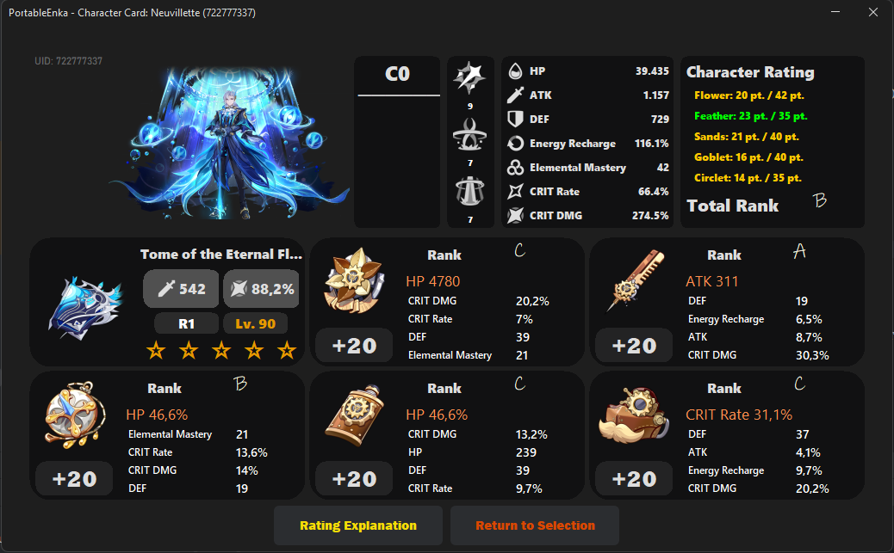

# Portable Enka
**PortableEnka** is a Java application made with **Swing, FlatLaf & [EnkaNetworkAPI](https://github.com/kazuryyx/EnkaNetworkAPI)** to provide users a showcase similar to how it is done on https://enka.network.

Additionally, this application provides not only a build card, but also a rating system which automatically rates artifacts based on roll efficiency & character stat tables. If you wish to know more about the rating system, then be sure to scroll down and find out more about it.

### Requirements
- Java 17
- A screen equal to or bigger than 1050x650 (otherwise  application will quit immediately)

### Installation
Head over to the Releases tag and download the newest JAR. Simply execute it and enter any UID.

### Current Features
- Hover over a stat to highlight any of that stat.
- Fetching between any server with no server selector.
- View Public Details from UID

### Showcase Images

## Rating Explanation
### Trigger Warning: Math

So, imagine every character in the game has a "stat weight table", I will be taking Hu Tao for this example, but just imagine that every character has their own table with their own values set.

| Stat              |  Weight |
|-------------------|---------|
| HP                |    1    |
| ATK               |   0.5   |
| DEF               |    0    |
| CRIT Rate         |    1    |
| CRIT DMG          |    1    |
| Elemental Mastery |   0.75  |
| Energy Recharge   |    0    |
| Healing Bonus     |    0    |
| Elemental Damage  |    1    |

*CRIT Rate and CRIT DMG will always be at 1 for every character, considering anyone may be built as a DPS.*

In this case, we are setting Energy Recharge, Healing Bonus, DEF to 0 because Hu Tao does not need it.

| Weight |  Type                                              |
|--------|----------------------------------------------------|
| 0      | Character does not need stat                       |
| 0.5    | Character wants stat, but not necessary            |
| 0.75   | Stat is important                                  |
| 1      | Character scales off that stat, and/or you need it |

We will use the weights later when we need to calculate the points & max points of the artifact.

### Roll Efficiency
So, when rolling a substat on an artifact you can have 4 possible outcomes:
|                 |      |      |      |      |
|-----------------|------|------|------|------|
| CRIT Rate       | 2.7% | 3.1% | 3.5% | 3.9% |
| CRIT DMG        | 5.4% | 6.2% | 7.0% | 7.8% |
| RV (Roll Value) |  0.7 |  0.8 |  0.9 |  1.0 |

### How does this work?
So, when fetching data we receive a list of artifacts, which contains a list of **affix ids**, which can then be parsed into the said Roll Value (from 0.7 to 1 (or effectively 70% to 100%))

We will use Roll Value for the calculation of current points.
### Point Calculation
So, in order to get current points we can loop through the different rolls of an artifact (essentially a list of RVs from 0.7 to 1.0) so that we may end up with **[0.7, 0.7, 0.9, 0.8, 0.8, 0.9. 0.7, 0.7, 0.8]** (*3 to 4 elements from the substats that already are there + the rest from level 4, 8, 12, 16, 20*)

We then add the different stats together, so that we end up with **[CRIT Rate = {0.7, 0.7}, CRIT DMG = {0.9, 0.9}, Elemental Mastery = {0.8, 0.8, 0.8}]**.

When the stats are added together, we will convert the Rolls to points, which is done through the following formula:
> $(10 \times individualRV - 6) \times rvCount$

Now, if the affix (substat) is a flat stat, then we use the following formula:
> $points \div 2$

because flat stats do not really serve a purpose to that character.

Additionally, there should also be a multiplication if the artifact is not max level, therefore we do:

> $points * \dfrac{ArtifactLevel}{MaxArtifactLevel}$
### Maximum Point Calculation
In order to get the maximum points that can be obtained on an artifact, we firstly need to sort the weights of the character. I will again be using Hu Tao and sorting her weights.
| Stat              |  Weight |
|-------------------|---------|
| CRIT Rate         |    1    |
| CRIT DMG          |    1    |
| HP                |    1    |
| Elemental Damage  |    1    |
| Elemental Mastery |   0.75  |
| ATK               |   0.5   |
| DEF               |    0    |
| Energy Recharge   |    0    |
| Healing Bonus     |    0    |

The max points of an artifact are based on how many sub stats there are: Scanning the sorted weight list from 1 to substat amount.

For every scan we are checking if the stat (in weight) is equal to the main stat, and if that is the case we are adding $(2.5 * substatCount) * weight$ to the max points. (which only happens once or no times)

Now, what if the above scan was not successful: We simply award $substatCount * weight$ max points. At the end we are outputting the $calculatedPoints + (5 * substatCount)$.
### Tiers
So, to get point percentage we can use the following equation: $\dfrac{CurrentPoints}{MaxPoints} \times 100$

Which is then parsed into the following Tiers to display on the card:
| Total Percentage                  |   Tier  |
|-----------------------------------|---------|
| 0-19                              |    F    |
| 20-34                             |    D    |
| 35-47                             |    C    |
| 48-59                             |    B    |
| 60-75                             |    A    |
| 76-100                            |    S    |

### Credits
The application was made by me (kazury). However, the original concept & artifact rating algorithm was made by @Modos21.